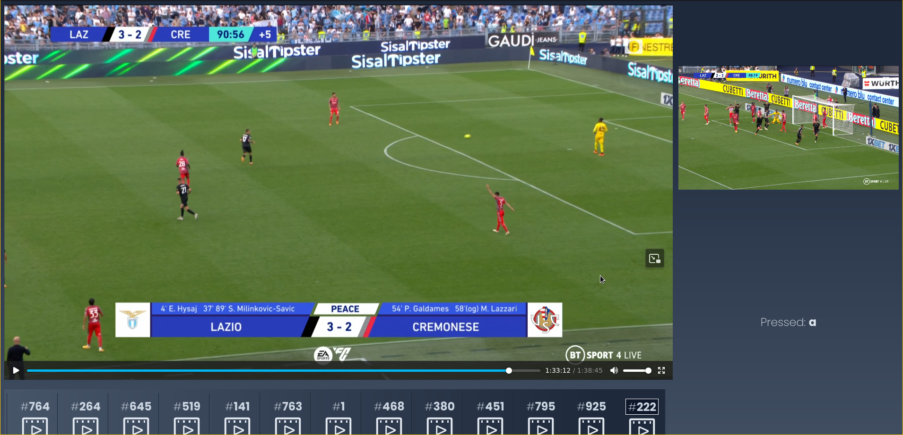

# vim-vid

Vim people will understand how to use this :smiley:

Available at [https://vim-vid.vercel.app](https://vim-vid.vercel.app/).



Built with:
* Vue3(TypeScript + Zod)
* Pinia
* Vite
* ctrl-keys

Try locally:
```bash
git clone https://github.com/uros-5/vim-vid
cd vim-vid
pnpm i
npm run dev
```
